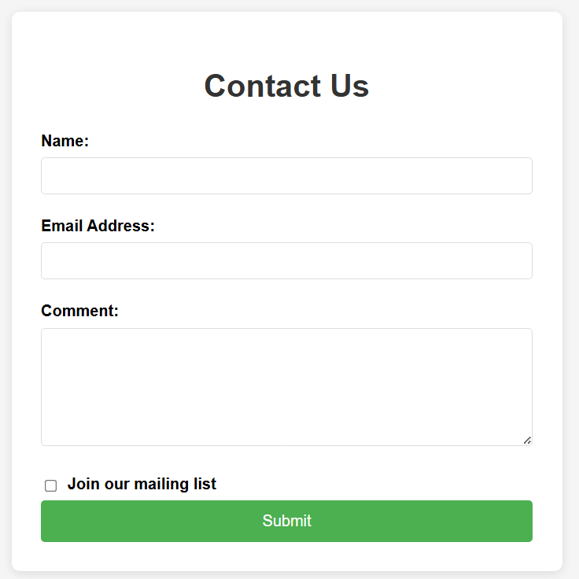

Que 1: Write a JavaScript program to display the current date and time in the following 
form : 
Today is Monday, 25/12/17 
Current time is 11 AM : 50 : 22 

Que 2 : (a) Crate a simple contact form that asks the user for his/her name, email address and a comment. 
(b)Add a Checkbox asking if the user would like to join your mailing list. 
(c)  Use some CSS to style your form : set a width to the form, align the labels to the left, put a background colour to your page. use HTML,CSS 